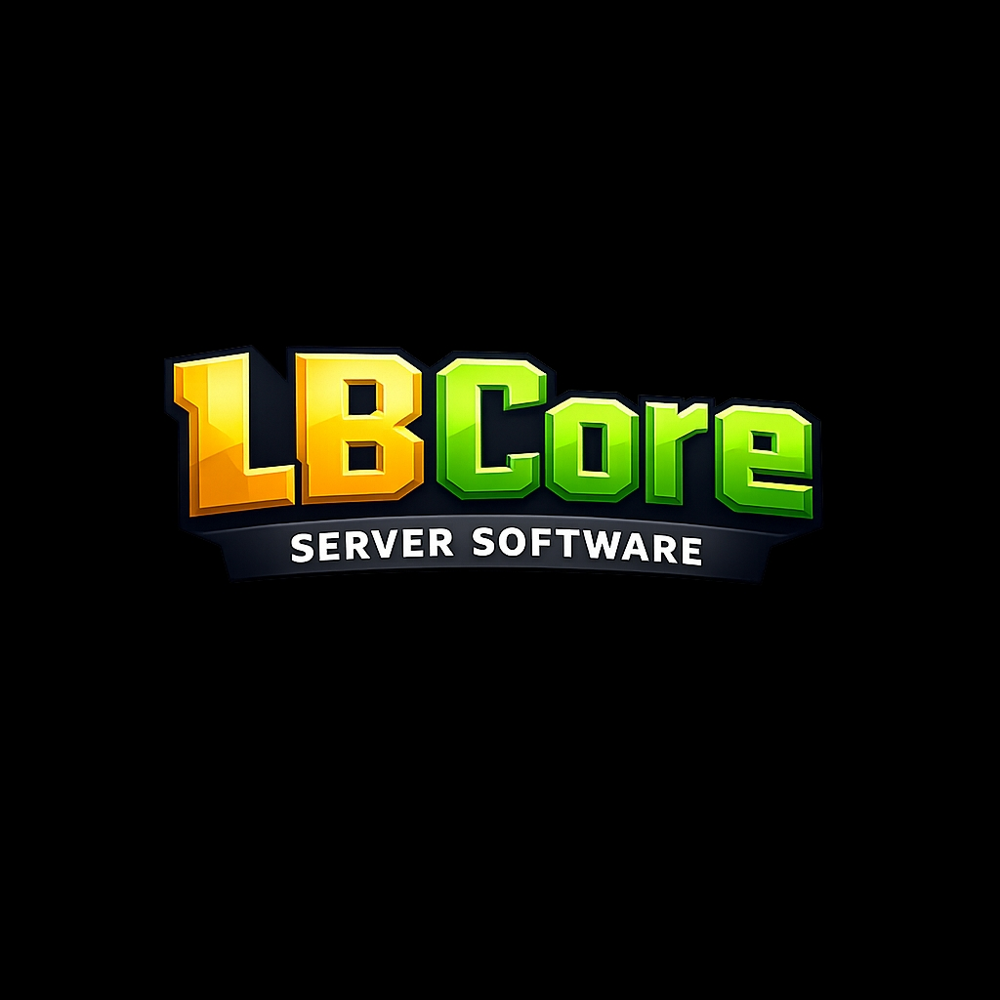

<p align="center">
  
</p>

<h1 align="center">LBCore</h1>
<p align="center"><b>LiveBedrock Core</b></p>
<p align="center">A from-scratch Minecraft Bedrock Edition server implementation in C++</p>

<p align="center">
  
  
  
  
</p>

---

# LBCore — LiveBedrock Core

**LBCore** is a from-scratch server implementation for **Minecraft: Bedrock Edition**, written in modern C++17. It handles the full stack needed to accept and run real Bedrock clients — from raw UDP networking up to game-level logic — without depending on existing server software like BDS, PocketMine, or Nukkit.

## What it does

LBCore is split into two networking layers:

- **LBNet** — a RakNet-compatible transport layer, implementing the low-level connection handshake (unconnected ping/pong, connection requests, acknowledgements, and reliable framed packets) that Bedrock clients require before any game data can be exchanged.
- **LBBNet** — the Bedrock game protocol layer built on top of LBNet, handling login and encryption (including the ECDH/ECDSA handshake for Xbox Live–authenticated clients), world state (chunk streaming, spawn position, biome definitions), player state (health, attributes, inventory), and general game rules and packet routing.

Supporting components include:
- **Encryption** — EC keypair generation and AES encryption for the login handshake (via OpenSSL)
- **Compression** — packet compression (via zlib)
- **Logging** — a simple tee logger that mirrors console output to a log file per run

## Status

This is an active, work-in-progress reimplementation of the Bedrock protocol — expect missing features and breaking changes as packet coverage expands.

## Building

Requires CMake 3.10+, a C++17 compiler, OpenSSL, and zlib.

```bash
mkdir build && cd build
cmake ..
make
```

This produces the `LBCore` executable.
